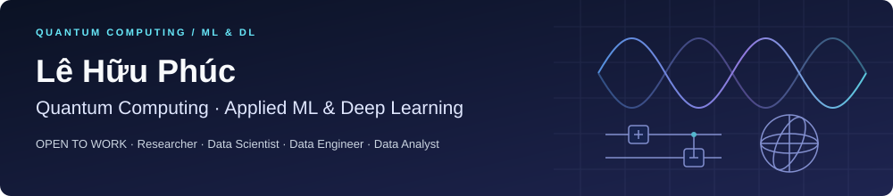

# Hi, I'm Lê Hữu Phúc

**Quantum Computing & Applied Machine Learning**

Bachelor’s student at Ho Chi Minh City University of Technology (HCMUT) · Vietnam

**Open to work** · Seeking research roles in quantum computing and AI.

I explore quantum computing and applied machine learning through research code and practical systems. My work spans quantum-ready optimization, hybrid quantum–classical models, and hyperspectral data analysis. I also build retrieval and evidence-verification tools to support research workflows.

## Professional Focus

- **Quantum Computing:** Working with variational circuits, quantum simulation, and quantum-ready QUBO formulations.
- **Applied Machine Learning:** Studying hyperspectral band selection, classification, and spectral unmixing.
- **Computer Vision & Representation Learning:** Co-authored work on pose-based human activity recognition using triplet embeddings and multiple instance learning.
- **Research Engineering:** Developing inspectable Python implementations, experiment pipelines, and tests with explicit experimental scope.
- **AI Systems & LLMs:** Building document-retrieval and evidence-verification tools, while exploring tool-using agents and their evaluation.

## Technical Stack

| Area | Technologies and methods |
|---|---|
| **Languages & Scientific Computing** |   · SciPy · pandas |
| **Quantum Computing** |  · Variational circuits · Statevector simulation · QUBO modeling |
| **Machine Learning & Deep Learning** |    |
| **AI Systems** | MCP · Transformers · BM25 · LangChain · LangGraph · FAISS |
| **Developer & Research Tools** |   · Jupyter · pytest · SQLite · FastAPI · Streamlit |

## Publications & Research

Selected co-authored work:

### From Noisy Beacons to Precise Location: A Confidence-Guided Cycle Retraining Strategy

*2026 International Conference on Activity and Behavior Computing (ABC)* · IEEE · 2026 
**Conference proceedings paper** · [DOI: 10.1109/ABC68169.2026.11592807](https://doi.org/10.1109/ABC68169.2026.11592807)

### Recognizing Normal and Unusual Human Activities from Pose Sequences Using Triplet Embeddings and Multiple Instance Learning

*Journal of Physics: Conference Series* **3180**, 012001 · 2026 
**Conference-series paper** · [DOI: 10.1088/1742-6596/3180/1/012001](https://doi.org/10.1088/1742-6596/3180/1/012001)

### VNAL-PA: Variance-Normalized QUBO Optimization for Quantum-Ready Hyperspectral Band Selection

*IEEE Quantum Week / QCE 2026* 
**Accepted for publication — DOI pending.**

## Current Explorations

I’m interested in stronger evaluation of hybrid quantum–classical models, broader validation of hyperspectral unmixing methods, and AI agents that make retrieved evidence easier to inspect.

Explore my [public repositories](https://github.com/LloydPhuc?tab=repositories) for implementations, experiment notes, and project updates.

## Connect

[GitHub](https://github.com/LloydPhuc) · [ORCID](https://orcid.org/0009-0006-9126-0730) · [LinkedIn](https://www.linkedin.com/in/huuphucle/)
